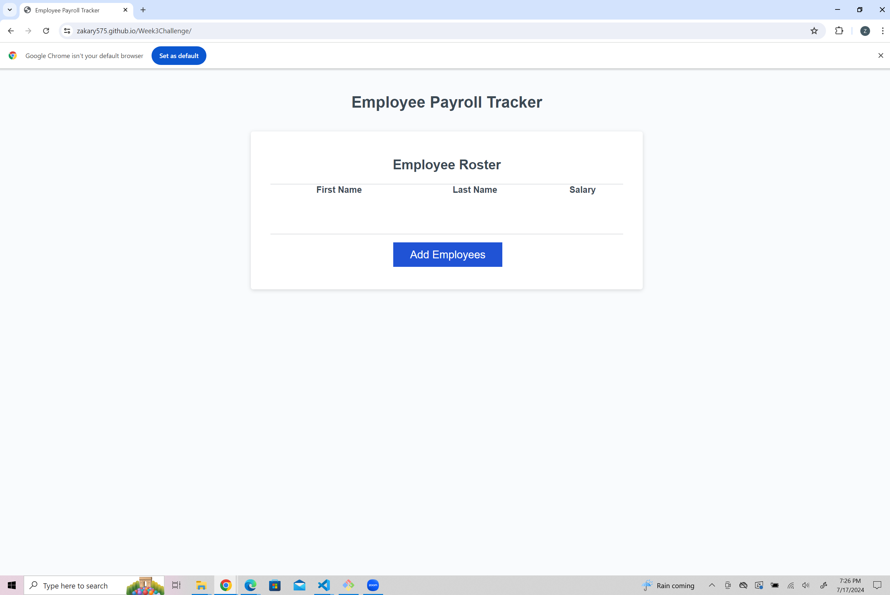

# Week3Challenge
Week 3 Challenge

## Description

This website can take in employee data, first name, last name and salary and create a table using that data. It will also find the average salary and choose a random employee and log it to the console.

## Usage

To use this app you click the "add employee" button and you are prompted to put in the employess first name last name and salary. once finshed you will be prompted if you would like to put in another emplyee. once you are done submitting all the employess a table will be generated with the data.

